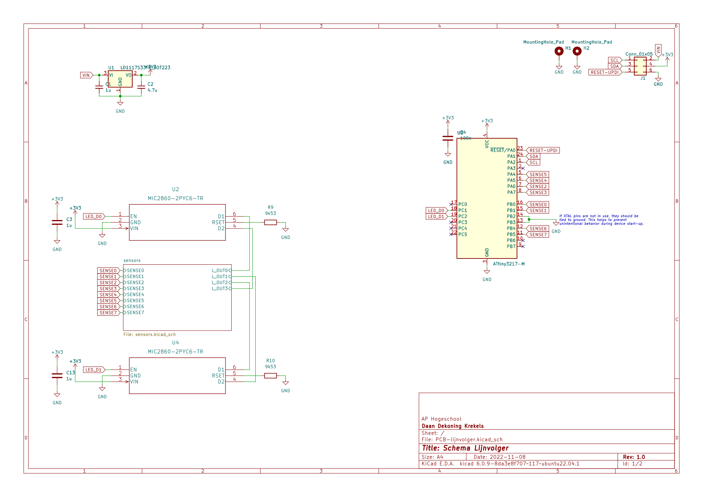
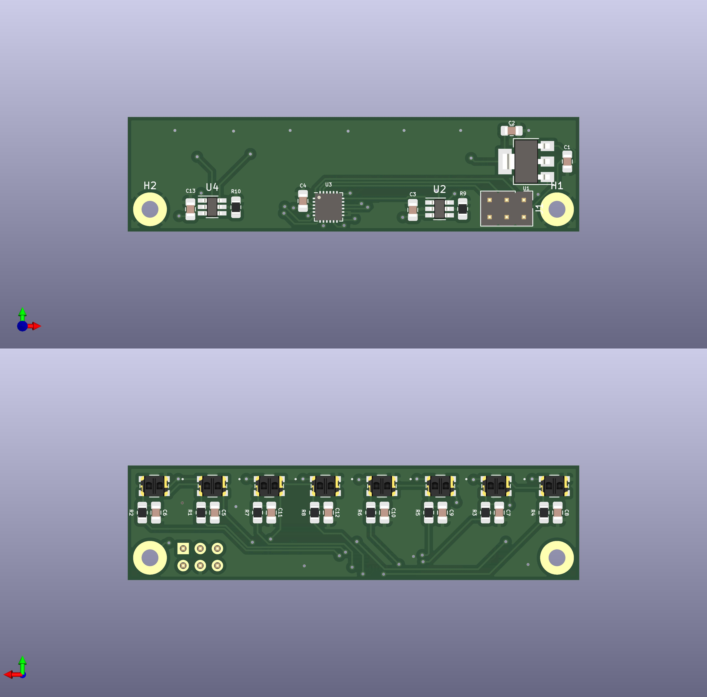

# PCB Lijnvolger


## Snelle links

- [Opdrachtomschrijving](./oo2-opdrachtbeschrijving.pdf)
- [Onderzoeksdocument](./onderzoeksdocument.md)
- [PCB-ontwerp](./src/kicad-project/)
- [Testplan bestukken printplaat](testplan.md)


## Project structuur

```
.
├── assets                  (figuren)
├── datasheets              (datasheets gebruikte componenten)
└── src                     (alle bronbestanden)
    ├── kicad-project       (PCB-ontwerp)
    ├── LEDD0-test          (test voor LED Drivers)
    ├── SENSE-0-1-test      (test voor eerste sensoren)
    ├── TinyLijnvolger      (finale code)
    └── WIRE-test           (test voor I2C verbinding)
```

## Verslag PCB-lijnvolger

In deze repository kan alle informatie teruggevonden worden rond dit project.


Het onderzoeksdocument beschrijft de algemene verwachtingen voor dit project en hoe ik van plan was het aan te pakken. Ik denk dat het onderzoek vrij goed aansluit met hoe het project uiteindelijk is verlopen. Het jammere is dat ik de meeste code niet heb kunnen testen omdat I2C niet werkt. Dit is echter een softwareprobleem en ligt niet aan het ontwerp van de printplaat.




Zo zou de PCB eruit zien:




Dit is hoe de definitieve printplaat eruit ziet:


