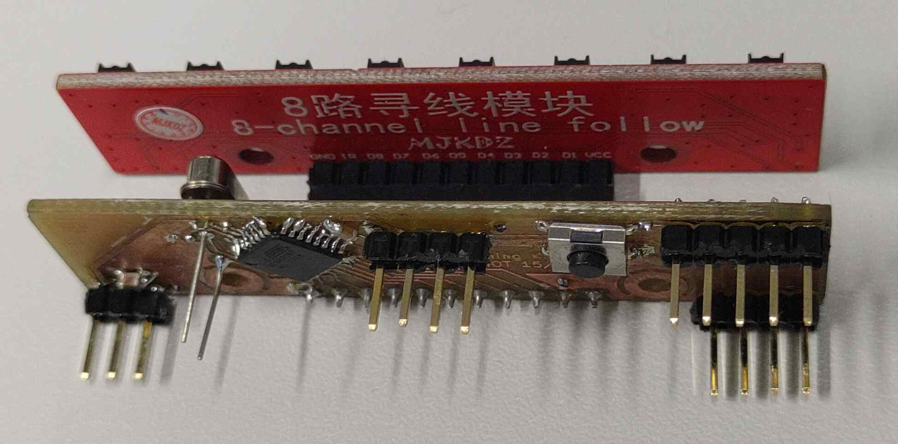
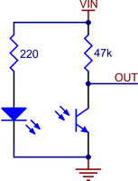
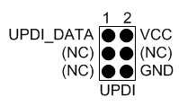

# Onderzoeksdocument – Lijnvolger

*Daan Dekoning Krekels*

## Geef een kritische analyse van je vorige PCB

> Werkte de PCB, heb je deze kunnen programmeren en data kunnen versturen over de I2C. 
>
> Als dit niet lukte, geef ook weer waarom.

Informatie over mijn printplaat kan je hier terugvinden: https://daandekoningkrekels.github.io/SmartSystems-RobotWagen/sensor-module/

Informatie over de bijhorende code hier: https://daandekoningkrekels.github.io/SmartSystems-RobotWagen/code/#sensor-module

Mijn PCB werkte niet, ik heb deze niet kunnen programmeren.

Over het algemeen denk ik dat de PCB vrij goed is gelukt eens de via's en clearances correct waren ingesteld.

Een grote moeilijkheid bij het bestukken van de print was dat er geen via's meer beschikbaar waren op school. De via's moest handmatig worden gemaakt door een stukje kabel te solderen in ieder gat. Hier had ik op voorhand geen weet van en dat resulteerde in het probleem dat bijvoorbeeld onder de microcontroller een aantal vias aanwezig zijn, die maken dat de MCU niet mooi vlak op de PCB staat en dat kan misschien op de lange termijn voor connectieproblemen zorgen.

KiCad gaat er, met de huidige instellingen, vanuit dat de gaten van through hole componenten beide kanten van de printplaat met elkaar verbinden. Dat is niet het geval waardoor ik bijvoorbeeld pin-headers en het through-hole kristal langs beide kanten moest solderen.

Het had beter geweest als ik op voorhand rekening had gehouden met deze beperkingen zodat ik geen via’s onder een IC heb en geen banen naar beide kanten van through-hole componenten.

Op volgende foto zie je dat mijn kristal iets hoger staat, dat is omdat ik langs beide kanten heb moeten solderen. Hetzelfde geldt voor de pinheaders, daarbij heb ik eerst de plastic isolatie naar boven gedaan en na het solderen terug tegen mijn printplaat gedrukt.

 

## Welke aanpassing zou je maken in V2 i.k.v. de Smart Systems opdracht

> Als je nog een iteratie zou maken voor de opdracht van Smart Systems (niet PCB Design Advanced) welke verbeteringen zou je dan aanbrengen 

Als we de PCB terug zouden moeten frezen op school, zou ik meer rekening houden met de limietringen die daarbij van toepassing zijn. Zo zou ik bij pinheaders maar langs één kant banen trekken en via’s eerder in het midden van het bord zetten ipv. onder een IC. 

Op vlak van documentatie zou ik, als de PCB werkt, ook een gedetailleerde handleiding maken over hoe de bootloader kan geflasht worden.

Ik ben fan van de vormfactor dus die zou ik zeker behouden.

## Als je code hebt geschreven voor je project, voeg deze ook toe als zip 

> GitHub of andere online git repo is ook toegelaten

Informatie over de bijhorende code hier: https://daandekoningkrekels.github.io/SmartSystems-RobotWagen/code/#sensor-module

## Welke componten wordt er gebruikt ter detectie van lijn

> Zoek uit welke component er gebruik kan worden voor de lijn detectie. Zoek een zo gelijkaardige component. Voorzie een link naar een mogelijk leverancier (Farnell, Mouser, Digi-Key)

https://nl.farnell.com/sharp/gp2s700hcp/photointerrupter/dp/1618426

De MIR-3.0Y module bezit over 8 infrarood sensoren. Dit is een enkele component waarin een infrarood led zit en een infrarood phototransistor.

Een lijnvolger kan ook beschikken over een LED-driver. Die zorgt ervoor dat er altijd dezelfde stroom vloeit door de LED’s waardoor de helderheid constant is, ookal varieert de ingangsspanning. Een constante helderheid is belangrijk wanneer we de reflectie willen meten, de weerstand van de fototransistor zou anders totaal verkeerd zijn ten opzichte van de afstand.

## Op welke manieren kan de lijndetectie component worden aangestuurd

> Er zijn twee mogelijke manier om de lijn detectie module uit te lezen. Welke zijn dit? 
>
> Geef ook de nodige conditioneringscircuit om dit te doen, m.a.w. het deelschema rond de lijn detectie component 

Je kan lijnvolger-data op een digitale of analoge manier interpreteren. De fototransistor die in de sensor zit geeft een analoge spanning afhankelijk van de reflectie van het infrarood licht. Bij het andere type zal het logische niveau veranderen.

Er zijn verschillende manieren om dit te verwezenlijken. Voor de analoge spanning kan de uitgang van de fototransistor door een ADC gelezen worden. Door de Weerstand die naar de VIN gaat ontstaat er een spanningsdeler en zal dus de uitgangsspanning afhangen van de weerstand die de transistor heeft. Deze weerstand is uiteraard afhankelijk van de reflectie.

Voor de logische niveaus kan er gebruik gemaakt worden van een condensator naar de VIN. Wanneer er een puls gestuurd wordt vanuit de MCU zal de condensator opladen en geleidelijk aan weer ontladen, afhankelijk van de weerstand van de fototransistor. Door de lengte van deze ontlading te meten kunnen we achterhalen wat de reflectie is.

De analoge versie kan echter ook op andere manieren gebruikt worden. Zo kunnen we een normale digitale ingang gebruiken om zo de logische niveaus te weten. Hierbij hangen we af van wanneer de MCU een lijn als hoog of als laag beschouwt. Een andere optie is om een comparator te gebruiken en zo de analoge spanning om te zetten naar een hoge of lage uitgang.

Voor de printplaat kunnen we in principe opteren voor beide. Als de footprints worden voorzien voor de digitale schakeling kan, indien gewenst, ook enkel de pull-up weerstand worden geïnstalleerd en het andere pad kan met een 0 Ohm weerstand bestukt worden.

## Welke pinnen worden er gebruikt in mijn design en waarom

> Vele pinnen van een microcontroller hebben meestal een dubbele functionaliteit. In dit vooronderzoek ga je kijken welke pinnen het veiligste zijn om te gebruiken.

Om de lijnvolger aan te sluiten ga ik gebruik maken van **PA4**, **PA5**, **PA6**, **PA7**, **PB5**, **PB4** en **PB1**. De enable van de lijnvolger sluit ik aan op **PB0**.

De bedoeling is om met één enkele lijn code op te halen welke digitale pinnen hoog of laag zijn. Dat kan dan ook worden opgeslagen in één enkele byte.

Diezelfde byte kan gebruikt worden om via bit checking na te gaan welke sensor geactiveerd is.

**PA1** en **PA2** worden gebruikt voor de USART verbinding. Deze pinnen ondersteunen ook I²C dus dat is achteraf ook een mogelijkheid, mits toevoeging pull-up weerstand.

Voor UPDI zal **PA0** worden vrijgehouden en beschikbaar gemaakt via testpads.

De MAX6970AAE+ LED controller zorgt ervoor dat de LED’s, onafahanelijk van de ingangsspanning een constante helderheid hebben. Deze IC communiceert via SPI dus zal aangesloten worden op SCK = **PC0**, MISO = **PC1**, MOSI = **PC2**, load-enable = **PC3** en output-enbale = **P****B3**. Met een 360 Ohm weerstrand aan de SET pin zal de LED controller 50mA per LED toestaan. Deze waarde kan uiteraard worden ingesteld naar eigen wensen.

Load-Enable Input. Data is loaded transparently from the internal shift register to the output latch while LE is high. Data is latched into the output latch on LE’s falling edge and retained while LE is low.

Output-Enable Input. High forces outputs OUT0 to OUT7 high impedance without altering the contents of the output latches. Low enables outputs OUT0 to OUT7 to follow the state of the output latches.

## Hoe programmeer ik de microcontroller

> Onderzoek hoe je de microcontroller kan programmeren en werk dit praktisch uit

Net zoals de AtTiny 1616 ondersteunt de 3216 ook UPDI.

De ATtiny beschikt over een UPDI of Unified Program and Debug Interface. Deze biedt de mogelijkheid om via één enkele aansluiting de MCU te programmeren. Omdat deze aansluiting via de RESET pin gebeurt, geven we hier ook geen enkele GPIO pin voor op.

Deze interface biedt ook de mogelijkheid tot een   
 half-duplex UART-verbinding op te zetten om bijvoorbeeld debug informatie te kunnen tonen.

Voor het programmeren via deze interface hebben we minstens toegang nodig tot de RESET pin, VDD en GND. De Atmel-ICE kan gebruikt worden om het programma naar de MCU te schrijven.

## Welke clockconfiguratie gebruikt mijn design en waarom

> Een microcontroller heeft meestal verschillende opties voor het aansturen van interne clockmodel. Licht toe welke optie je gaat gebruiken en waarom. 

Omdat het geen concrete benodigdheid is om zo energiezuinig mogelijk te zijn zou ik gebruik maken van de interne 20MHz klok.

## Hoe wordt de PCB van stroom voorzien?

> Op welk spanningsniveau zal je PCB werken, Hoe ga je het correcte voltage voorzien aan de horloge. 

De PCB zal voorzien worden van de LDL1117S50R 5 V spanningsregelaar. De ingangsspanning kan dus 5,35 V tot 18 V bedragen. Overtollige spanning wordt in een lineaire regelaar afgestaan als warmte waardoor bij hoge spanningen ook hoge temperaturen gepaard gaan.

Er is gekozen voor een spanningsregelaar zodat deze rechtstreeks mee op de PCB kan staan, dicht bij de andere componenten. Zo vermijden we onstabiele en onbetrouwbare spanningen.

Echter, zal er ook een aansluiting zijn om rechtstreeks 5 V aan de PCB te voeden. Dit maakt de PCB toegankelijker bij gebruik met bijvoorbeeld een Arduino.

Uiteraard wordt ook voor iedere component een eigen ontkoppelcondensator voorzien zodat deze een stabiele ingangsspanning hebben.

## Bronnen

https://www.tinytronics.nl/shop/en/sensors/optical/infrared/8x-ir-line-tracking-module-40mm-range

https://www.pololu.com/product/4541

https://www.pololu.com/docs/0J19/1

## Datasheets:

Alle datasheets zijn ook beschikbaar in KiCad als je op een component staat en de 'D' indrukt.

https://datasheets.maximintegrated.com/en/ds/MAX6970.pdf

https://www.farnell.com/datasheets/53142.pdf

http://ww1.microchip.com/downloads/en/DeviceDoc/ATtiny3216-17-DataSheet-DS40002205A.pdf

https://www.farnell.com/datasheets/2259188.pdf

https://ww1.microchip.com/downloads/en/Appnotes/AN2519-AVR-Microcontroller-Hardware-Design-Considerations-00002519B.pdf