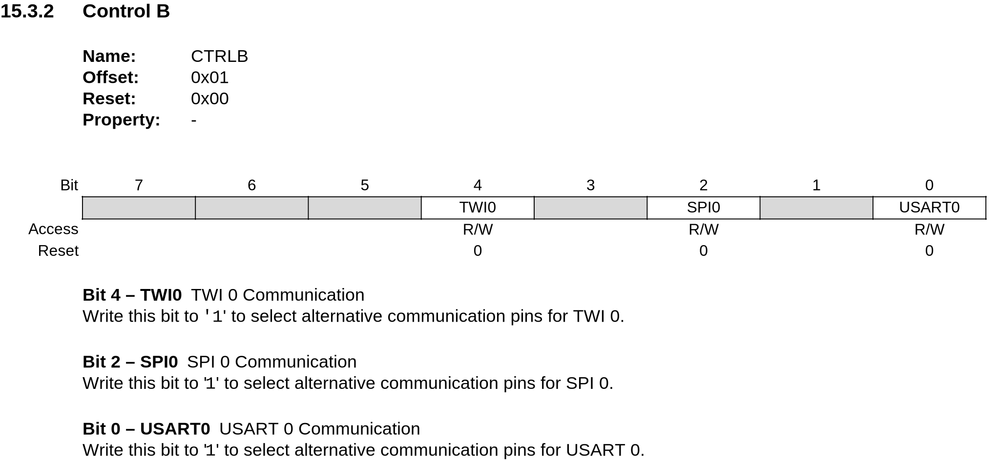

# Proces softwareontwikkeling

Zoals in het testplan te lezen is werd niet alle software in 1x geschreven. Er moesten incrementeel delen (individueel) getest worden om te weten of alles naar behoren werkt.

## Enkel MCU

Voor het programmeren van de MCU via de Arduino IDE is gekozen voor de [megaTinyCore](https://github.com/SpenceKonde/megaTinyCore) boardfiles. Dit project is immens goed gedocumenteerd en alles is terug te vinden op de eerder gelinkte GitHub pagina.

Het programmeren zelf verloopt via [jtag2updi](https://github.com/ElTangas/jtag2updi), een tool die het mogleijk maakt om met een Arduino NANO een UPDI microcontroller te programmeren. magaTinyCore heeft ondersteuning om jtag2updi als programmer te gebruiken. 

De code die hier gebruikt is is een simpele blinky op PC1. Dat is een pad voor een van de LED drivers dus ik kon met een multimeter gemakkelijk de spanning meten.


## I²C testen

Jammer genoeg is het mij niet gelukt om dit aan de praat te krijgen. Omdat ik de standaard TWI pinnen (PB0 en PB1) verkozen had voor de photointerruptors heb ik de ALT pinnen naar buiten gebracht om langs te verbinden.

Om een of andere reden is het mij echter niet gelukt om een I²C verbinding tot stand te brengen. Ik heb verschillende mogelijkheden getest en om de I²C verbinding te controleren heb ik een ESP32 gebruikt met een adres scanner. 

De Wire bibliotheek van megaTinyCore heeft een aantal extra functies om het gebruik van de alternatieve pinnen te faciliteren. ([documentatie](https://github.com/SpenceKonde/megaTinyCore/blob/master/megaavr/libraries/Wire/README.md#methods-not-present-in-official-arduino-wire-library))
- `Wire.pins()` biedt de mogelijkheid om alternatieve pinnen expliciet aan te wijzen
  - De enige pinnen die hier kunnen worden meegegeven zijn de standaard TWI pinnen (PB0 en PB1) en de alternatieve pinnen (PA1 en PA2).
- `Wire.swap(n)` biedt de mogelijkheid ui te wisselen tussen een aantal voorgedefinieerde pinouts.
  - Voor de MCU die wij gebruiken is enkel `swap(0)` en `swap(1)` beschikbaar. 

Beide opties hebben I²C niet werkende gekregen in mijn geval. Als alternatief heb ik gezocht naar een manier om zelf de juiste pinout in te schakelen met een registermanipulatie. Die heeft echter ook niet geholpen. Op plaats 4 in het `PORTMUX` register `CTRLB` kan de alternatieve pinout worden ingeschakeld.




Als laatste redmiddel heb ik TinyCore geprobeerd. Die Wire bibliotheek biedt ook een manier om de alternatieve pinout te gebruiken. ([documentatie](https://docs.tinycore.dev/en/latest/usage.html#i2c)) 

`WIRE-test.ino`
```c++
// Wire Slave Sender

#include <Wire.h>

void setup() {
  // Deze functie zou de alternatieve pinout moeten activeren.
  // Wire.pins(18, 19);
  Wire.pins(PIN_PA1, PIN_PA2); 
  // Deze functie zou dit ook moeten doen
  Wire.swap(1); 
  // TWI ALT - Deze register schakelt de alternatieve pinout volgens de datasheet in
  PORTMUX.CTRLB |=   1 << 4; 

  // TinyCore: wisselen met alternatieve TWI pinnen
  Wire.useAlternatePins(); 

  Wire.begin(0x55);              // join i2c bus met adres 0x55
  Wire.onRequest(requestEvent);  // register event
}

void loop() {
  delay(100);
}

// function that executes whenever data is requested by master
// this function is registered as an event, see setup()
void requestEvent() {
  Wire.write("oi");  // respond with message of 2 bytes
  // as expected by master
}
```

## Photointerrupter testen

Ik heb telkens twee fotointerrupters in serie staan met elkaar dus ik ben gestart met één serieschakeling van de fotointerrupters te bestukken en testen. Met een camera is te zien of de LED's oplichten.

Later heb ik de code uitgebreid om ook de tweede LED-driver te testen.

```c++
#define LEDD0 13  // PC1
#define LEDD1 14  // PC2

void setup() {
  pinMode(LEDD0, OUTPUT);
  pinMode(LEDD1, OUTPUT);
}

void loop() {
  // put your main code here, to run repeatedly:
  digitalWrite(LEDD0, LOW); // IR LEDS gaan aan
  delay(500);
  digitalWrite(LEDD0, HIGH); // IR LEDS gaan uit
  delay(500);
  digitalWrite(LEDD1, LOW); // IR LEDS gaan aan
  delay(500);
  digitalWrite(LEDD1, HIGH); // IR LEDS gaan uit
  delay(500);
}
```

## Alles samenbrengen

In de finale code zal de lijnvolger een slave zijn waar de master een byte naar kan sturen om een bepaalde werkingsmodus in te schakelen of een aanvraag sturen om de data van de photointerruptors door te krijgen.

Via het `Wire.print()` statement zal een char array verstuurd worden. In deze char array zitten de actuele waardes van de photointerruptors.

Er zijn 4 modi beschikbaar:
1. `FAST_DIGITAL`: De IR LED's daar altijd aan staan en de master zal een byte array krijgen met 1en en 0en per sensor.
2. `FAST_ANALOG`: De IR LED's daar altijd aan staan en de master zal een byte array krijgen met de ADC waarde per sensor.
3. `ANALOG`: De IR LED's worden ingeschakeld op aanvraag en de master krijgt een byte array met de ADC waarde per sensor.
4. `DIGITAL`: De IR LED's worden ingeschakeld op aanvraag en de master krijgt een byte array met 1en en 0en per sensor.

De FAST-modi kunnen gebruikt worden om bijvoorbeeld sneller data te ontvangen waar de master nog een gemiddeldeberekening op uitvoert.

Idealiter zouden de DIGITAL-modi maar één byte doorsturen met op iedere bit de digitale waarde van de corresponderende photointerruptor.

